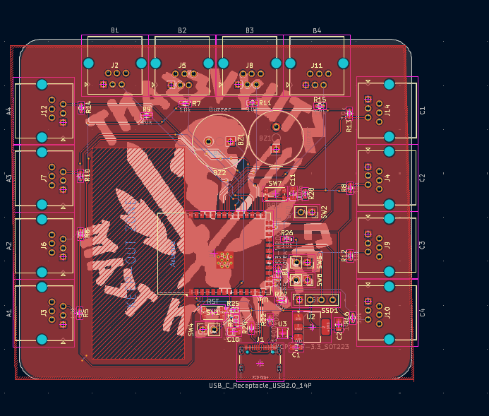
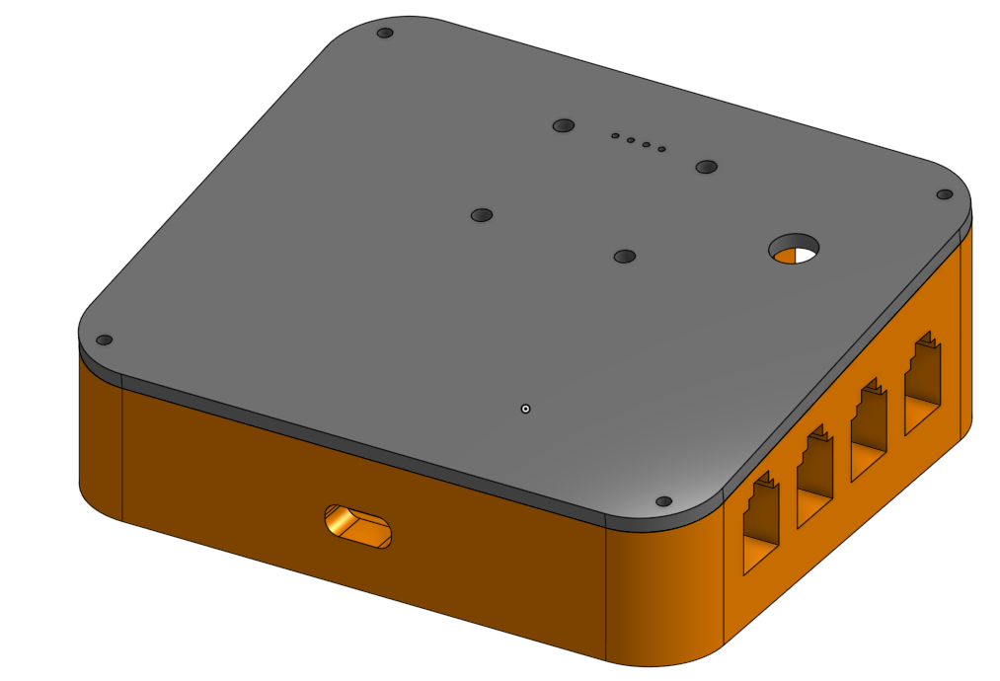
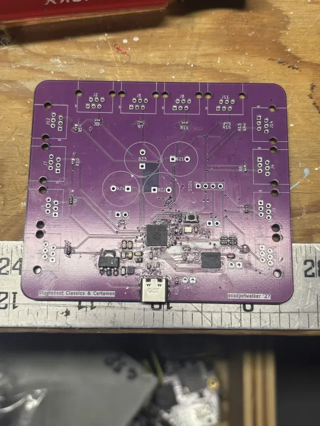

# CertamenBuzzersV2

A buzzer system for the game Certamen about Roman language, mythology, history, and culture. It is a quiz bowl style game, where whoever buzzes first gets a chance to claim the points.

# Why I made this

I made this because right now buzzer systems are inaccessible. Buzzer systems are sold by JCL, but they have a monopoly over it, so they mark up the prices incredibly even though the electronics are fairly simple, to 800 dollars. for the small version. I made this for my team, because they need a buzzer system to get practice in, since hyperbuzzing is an important strategy in more competitive leagues, as well as the fact that the current version is very bulky and you cannot bring it to places for practice.

# Wiring Diagram

Wire - Button - Wire

# Pictures

# BOM

| Name | Purpose | Quantity | Total Cost (USD) | Link | Distributor |
|------|---------|----------|------------------|------|--------------|
| Soldering Iron | Soldering | 1 | 34.96 | [Amazon](https://www.amazon.com/Soldering-Temperature-200-480%E2%84%83-Compatible-Function/dp/B0FJDRF6S5/ref=sr_1_4?sr=8-4) | Amazon |
| 6P4C RJ11 Connector | Connecting to wires | 1 | 5.89 | [Amazon](https://www.amazon.com/Telephone-Modular-Connector-Compatible-Stranded/dp/B07YZ79DCY/ref=sr_1_3?sr=8-3) | Amazon |
| Buttons | Buttoning | 1 | 7.99 | [Amazon](https://www.amazon.com/Twidec-Momentary-Button-Pre-soldered-R13-507BK-X/dp/B0CYSSFWSS/ref=pd_ci_mcx_di_int_sccai_cn_d_sccl_1_2/137-6738652-1809662) | Amazon |
| PCB + Stencil | PCB | 1 | 6.15 | | JLCPCB |
| 4 | RF TXRX MODULE BT PCB TRACE SMD | 2 | 10.42 | | Digikey |
| 3 | IC REG LINEAR 3.3V 1A SOT-223 | 2 | 0.76 | | Digikey |
| 2 | SWITCH TACTILE SPST-NO 0.05A 32V | 4 | 2.68 | | Digikey |
| 1 | RES 10K OHM 1% 1/10W 0603 | 50 | 0.75 | | Digikey |